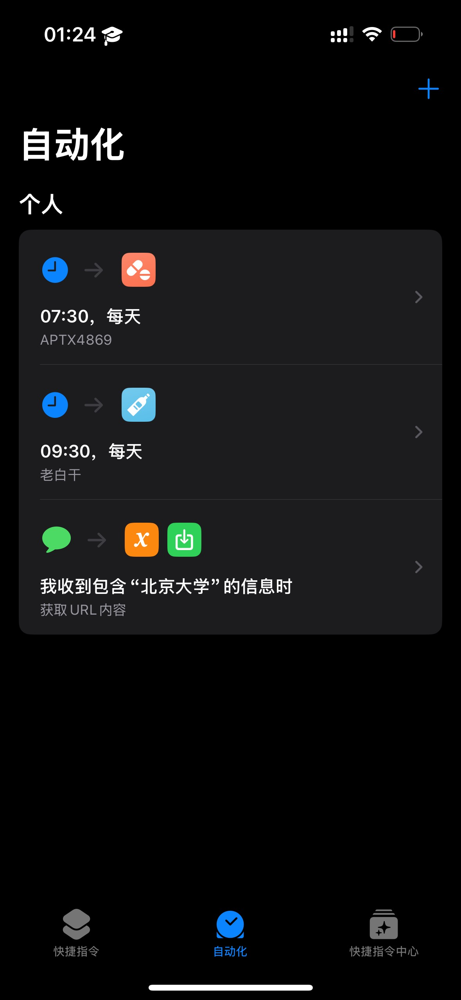
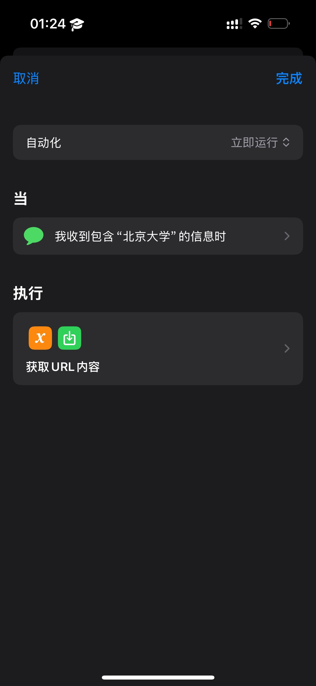
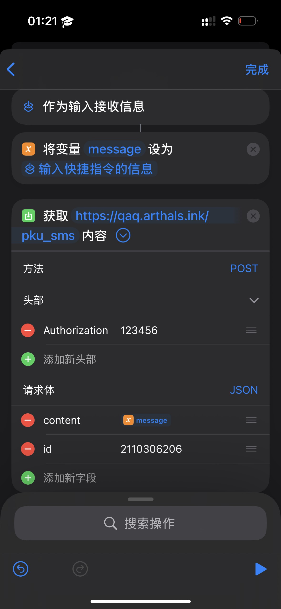
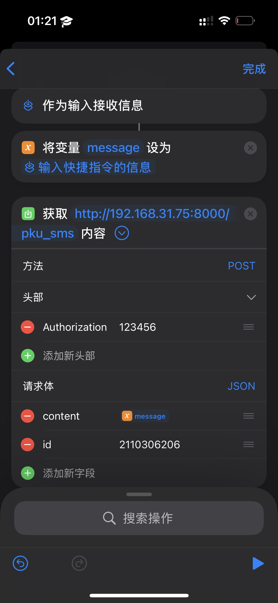
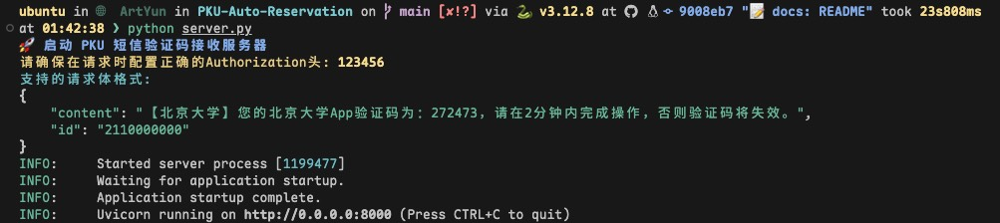

# 北京大学自动预约入校

鉴于暑假预约入校过于火爆，便有了这个小工具来提高成功率。

~~由于 2FA 的存在，这个流程无法自动化，只能半自动化完成，故你仍然需要在零点准时守在电脑前。~~

这个工具现已彻底自动化了所有网络请求，包括 2FA 验证。

## ✨ 功能

-   🤖 全自动/半自动预约入校申请，支持无额外服务器部署
-   👥 支持多个学生账号同时预约不同日期
-   📅 智能调度：超过三天提前预约，不足三天立即执行
-   ⏰ 自动定时提交申请，再无需上演速度与激情
-   📢 Bark 通知，支持每个学生独立的通知配置

## 🚀 简要上手教程

1. 复制 `config-sample.yaml` 为 `config.yaml`，并根据新的格式填写其中的信息
2. 安装依赖：`pip install -r requirements.txt`
3. 运行 `python main.py` （使用默认配置文件）
4. 或者使用 `python main.py -f <config_path>` 指定特定的配置文件

程序支持以下命令行参数：

-   `-f <config_file>` 或 `--config <config_file>`：指定配置文件路径（默认：`config.yaml`）

示例：

```bash
# 使用默认配置文件
python main.py

# 指定特定配置文件
python main.py -f student1.yaml
python main.py --config student2.yaml
```

这使得你可以为不同学生创建单独的配置文件，并通过多个进程并行运行。

## ⚙️ 配置说明

### 配置文件结构

示例参见 `config-sample.yaml`。

### 字段说明

#### 学生信息

-   `username`: 学生学号（用于 IAAA 登录）
-   `password`: IAAA 密码
-   `phone`: 学生手机号
-   `bark`: （可选）Bark 通知 key
-   `auto`: 是否全自动化，true 为全自动，false 为半自动需要手动输入验证码

#### 预约列表

每个预约包含：

-   `yyrq`: 预约日期，格式为 YYYYMMDD
-   `yyxm`: 预约校门
    -   燕园：西南门 / 西侧门 / 东侧门 / 东南门 / 小东门 / 南门 / 万柳 / 畅春新园
    -   新燕园：东门 / 南门
-   `yysj`: 预约时间，格式为 HH:MM
-   `yysy`: 预约原因
-   `mode`: 预约模式，可选 燕园 / 新燕园
-   `visitors`: 同一天的被预约人信息列表
    -   `name`: 姓名
    -   `id`: 身份证号
    -   `phone`: 手机号

## 🔄 调度逻辑

程序会自动为每个预约计算最佳执行时间：

-   **超过 3 天的预约**：在预约日期前 3 天的 8:00:01 自动执行
-   **不足 3 天的预约**：立即执行
-   **多个预约任务**：按配置中的顺序串行处理，避免同一预约者的并发冲突

## 👥 多学生支持

为了支持多个学生同时进行预约，推荐使用以下方法：

1. **为每个学生创建单独的配置文件**：

    - `student1.yaml`：只包含学生 1 的信息和预约
    - `student2.yaml`：只包含学生 2 的信息和预约

2. **分别运行多个进程**：
    ```bash
    python main.py -f student1.yaml
    python main.py -f student2.yaml
    ```

## 📢 通知功能

-   每个学生可以配置独立的 Bark 通知 key
-   支持预约启动、成功、失败等状态通知
-   如果学生没有配置 bark，则只在控制台输出日志

## 🤖 自动化输入验证码

> [!IMPORTANT]
> 自动化输入验证码需要设置 `config.yaml` 中的 `auto` 配置项为 `true`

### ♾️ 验证码流程

1.  本程序请求验证码时，会清空对应学生的验证码文件（如 `2110000000.txt`）
2.  手机收到短信后，自动发送 POST 请求到 HTTP 服务器（示例参见 `server.py`），示例请求体：
    ```json
    {
        "content": "【北京大学】您的北京大学App验证码为：272473，请在2分钟内完成操作，否则验证码将失效。",
        "id": "2110000000"
    }
    ```
3.  HTTP 服务器解析学号并将验证码写入对应的文件
4.  程序检测到对应学生的验证码文件有内容后，提取验证码并清空文件

由于作者设备所限，只给出 iOS 版本的方法。安卓的权限管理更为宽松，应当不难实现类似功能，参考 [这个项目](https://github.com/pppscn/SmsForwarder)。

> [!NOTE]
> 注意，彻底自动化需要 iOS 17 及以上版本，因为立即执行（而无需再手动点击）是 17 出的新功能。

首先，请解绑手机北京大学 APP `我的 - 手机令牌`，因为我们无法自动化获取 TOTP 令牌来完成验证，取而代之的是使用短信验证码。

为了使得服务器获得短信验证码，我们需要使用 `快捷指令` 来将短信内容发送到服务器。

### 示例自动化快捷指令

<div align="center">
    
    
    
</div>

快捷指令各步骤搜索关键字：

1. 信息
2. 新建空白自动化
3. 设定变量
4. 获取 URL 内容

### 🌐 HTTP 服务器

参见 `server.py`，提供了完整的验证码处理功能。你可能需要修改其中的 Authorization 头信息鉴权（默认为 `123456`）。

对于 Nginx 服务器部署、SSL 证书自签与反向代理，超出了本仓库的范围，在此不再赘述。

### 🏠 无额外服务器

如果你没有额外的服务器或者域名，那么也可以如下操作：

1. 确保零点的时候你的电脑和手机位于同一个局域网下（如果你连这个都无法确保，也可以通过 [Tailscale](https://tailscale.com/) 进行异地组网）并都保持开机
2. 修改 HTTP 服务器的侦听 Host 为 `0.0.0.0`
3. 在手机的自动化快捷指令上使用 `http://<你的电脑局域网 IP>:<端口>` 来访问电脑上的 HTTP 服务器并提交验证码

macOS 的局域网 IP 可以通过如下命令获取：

```bash
ifconfig | grep "inet " | grep -v 127.0.0.1 | awk '{print $2}'
```

Windows 的局域网 IP 可以通过如下命令获取：

```powershell
ipconfig | findstr IPv4
```

Ubuntu 的局域网 IP 可以通过如下命令获取：

```bash
hostname -I
```

假设获取到的电脑局域网 IP 为 `192.168.31.75`，那么示例代码如下：

`server.py`

```python
...
if __name__ == "__main__":
    import uvicorn

    uvicorn.run(app, host="0.0.0.0", port=8000)
```

快捷指令（注意此时因为没有 SSL 证书，协议是 HTTP 而不是 HTTPS）

<div align="center">
    
</div>

### ✨ 自动获取验证码效果



## ✋ 半自动化输入验证码

> [!IMPORTANT]
> 半自动化输入验证码需要设置 `config.yaml` 中的 `auto` 配置项为 `false`

半自动化输入验证码会在需要输入验证码时，调用 `input()` 函数来获取你手动输入的验证码。

如果你配置了 Bark，那么程序会尝试在需要输入验证码时提前半分钟通知你准备输入（不足半分钟则立即通知）。

## 📊 测试结果

### 🌸 燕园

<div align="center">
    
</div>

### 🌅 新燕园

<div align="center">
    
</div>

## ⚠️ 免责说明

1. 本项目仅提供自动预约入校申请功能，节省同学时间，让广大同学拥有与黄牛的一战之力。
2. 因网络环境问题，不保证申请成功。
3. 仅供学习交流使用，**申请信息如果与事实不符可能会带来不必要的麻烦**。
4. **本仓库严禁用于任何商业用途！！！**

## 📜 许可证

本项目以 [GNU GPLv3](./LICENSE) 许可证开源。
